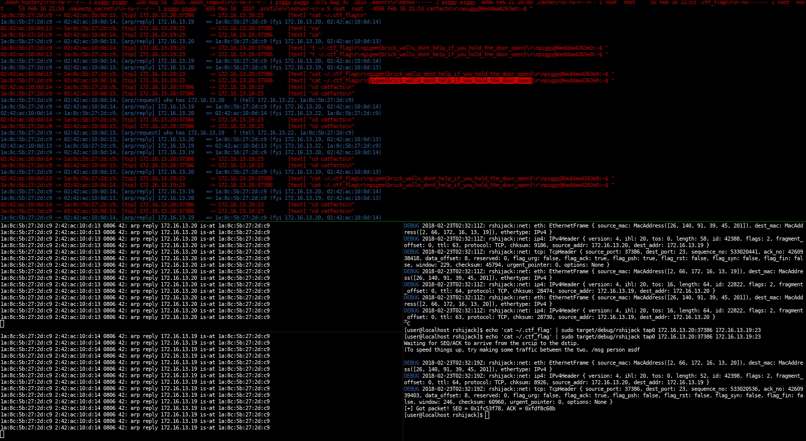

# rshijack [![Crates.io][crates-img]][crates]

[crates-img]:   https://img.shields.io/crates/v/rshijack.svg
[crates]:       https://crates.io/crates/rshijack

tcp connection hijacker, rust rewrite of [shijack] from 2001.

This was written for TAMUctf 2018, brick house 100. The target was a telnet
server that was protected by 2FA. Since the challenge wasn't authenticated,
there have been multiple solutions for this.  Our solution (cyclopropenylidene)
was waiting until the authentication was done, then inject a tcp packet into
the telnet connection:

    # if you don't know one of the ports use 0 to match any port
    echo 'cat ~/.ctf_flag' | sudo rshijack tap0 172.16.13.20:37386 172.16.13.19:23

After some attempts this command was accepted and executed by the telnet
server, resulting in a tcp packet containing the flag.

The way this works is by sniffing for a packet of a specific connection, then
read the SEQ and ACK fields. Using that information, it's possible to send a
packet on a raw socket that is accepted by the remote server as valid.

The other tools in that screenshot are [sniffglue] and [arpspoof].

[shijack]: https://packetstormsecurity.com/files/24657/shijack.tgz.html
[sniffglue]: https://github.com/kpcyrd/sniffglue
[arpspoof]: https://su2.info/doc/arpspoof.php

# Installation

## Arch Linux 

    pacman -S rshijack

## Docker

If needed, rshijack can be pulled as a docker image. The image is currently about 10.2MB.

    docker run -it --init --rm --net=host kpcyrd/rshijack eth0 172.16.13.20:37386 172.16.13.19:23

# Notable mentions

- 2020, August: [@ezequielpereira](https://github.com/ezequielpereira) wrote an [excellent blog post](https://offensi.com/2020/08/18/how-to-contact-google-sre-dropping-a-shell-in-cloud-sql/) about a GCE container->host escape with rshijack and contributed a [patch](https://github.com/kpcyrd/rshijack/commit/e3c797db372030b3b18f85913be264cf8a361db3) that was merged.

# License

GPLv3+
